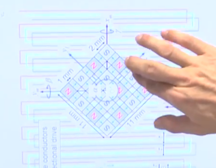

# 25.05
- Tests sur bobine linéaire

[gerrits Tagebuch #82](https://www.youtube.com/watch?v=3ujaGUFfgC0) : Parle des capteurs de Hall
[Gerrits Tagebuch #71](https://www.youtube.com/watch?v=D6jwZYrvSv4) : Début des prototypes. On voit les voitures à la fin et le réseau de hallbach au début

# [Gerrits Tagebuch #45](https://www.youtube.com/watch?v=bl5jziS66Zk)
Les débuts de Formel 1.
Ils en arrivent à la conclusion qu'il faut des bobines linéaires

# Simulation CST 
- Pas d'utilisation des macros
1. Faire des formes à la main
2. Boolean pour former un "méandre"
3. Copie en translation sur `nb_repetition`
4. Placer un Polygon3D pour relier les deux bouts
5. Current Port en selectionnant le polygon3D
6. Copie en décalant de largeur totale d'un méandre/3 (pour 3 bobines)

# 26.05 -> 31.05
Réalisation de simulations sur les bobines linéaires

# 01.06

Analyse des résultats.
Voir du coté des réseau de hallbach

9 fois

24x https://www.supermagnete.ch/fre/aimants-bloc-neodyme/parall-l-pip-de-magn-tique-8mm-4mm-3mm_Q-08-04-03-N
16x https://www.supermagnete.ch/fre/aimants-bloc-neodyme/parall-l-pip-de-magn-tique-8mm-8mm-4mm_Q-08-08-04-N
